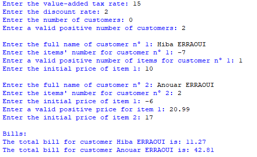

## Description
This program calculates and displays individualized total bills for clients, including their names. It allows you to input the value-added tax rate (VAT) and a discount rate, the number of clients, the number and initial prices of items while ensuring that all input values are positive.
## Example

